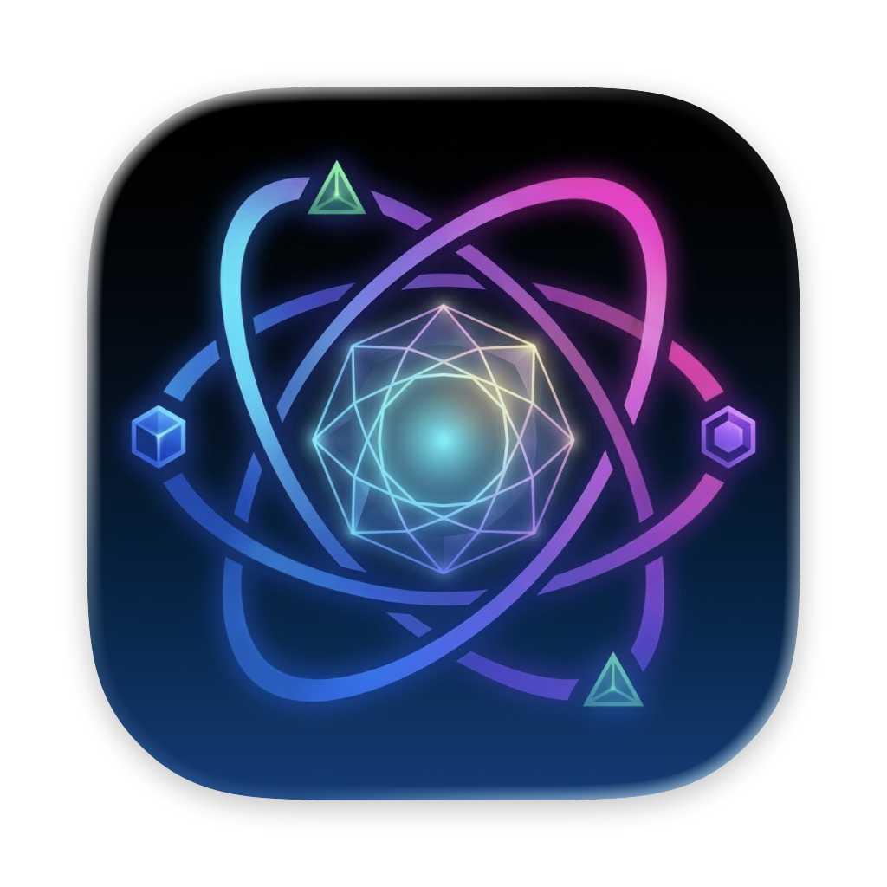

# Orrery

<p align="center">
  
</p>

[繁體中文](docs/README-zh_TW.md)

**Orrery is a runtime environment manager for AI tools.**

It lets you run Claude Code, Codex CLI, and Gemini CLI across isolated environments — each with its own account and credentials — while keeping your conversations continuous across account switches.

> The CLI command is lowercase `orrery`. The product name is capitalized **Orrery**.

---

## 🧠 Why Orrery?

Working with AI CLI tools today is messy:

- Switching accounts breaks your context
- Conversation history doesn't follow you across accounts
- Tools can't coordinate tasks between environments

Orrery solves this by introducing:

> **Isolated, composable AI environments**

Each environment has its own auth credentials and configuration. But sessions — your conversation history and project context — are **shared by default**, so you can switch accounts and pick up exactly where you left off.

---

## 🧩 Core Concepts

Start with **accounts** — that's all most people need. Reach for a **sandbox** only when a context needs fully isolated config.

### Account

Your **identity** for a tool — the credential Orrery logs in with. Accounts live in a shared pool: add once, switch any time with `orrery use`. This is the layer you'll touch every day.

### Sandbox _(advanced)_

An optional **isolation** layer: separate memory, sessions, and env vars on top of accounts. Most users never need one — reach for a sandbox when a client or project needs its own config space. Pin an account to it with `orrery pin <account> --workspace <name>`, then activate it with `orrery use <account>`.

### Session

Represents **continuity**: conversation history and project context. Shared across account switches by default — `claude --resume` just works after switching accounts.

### Phantom mode

`orrery run claude` launches Claude under a phantom supervisor. From inside that Claude session, the `/orrery:phantom` slash command can swap accounts without losing the conversation — Claude exits, the supervisor relaunches it with the new account and `--resume`. See the [Phantom Mode](#phantom-mode) section below.

### MCP Delegation

Assign tasks to specific accounts or sandboxes from within a running session. Enables multi-agent workflows where one Claude instance delegates to another running under a different account.

---

## 🧠 System Model

Orrery introduces a structured runtime model for AI tools:

- **Account** → isolates identity (credentials per tool)
- **Sandbox** _(optional)_ → isolates config (memory, sessions, env vars)
- **Session** → represents continuity (conversation, context, memory)
- **Phantom** → in-session switching without losing the conversation
- **Delegation (MCP)** → enables coordination between accounts and sandboxes

In traditional tooling:

- `virtualenv` isolates dependencies
- `nvm` isolates runtime versions

Orrery extends this idea to:

> **AI identity, context, and coordination**

---

## 🎯 Use Cases

- Managing multiple AI accounts (work / personal / clients)
- Running parallel AI workflows without credential conflicts
- Building multi-agent systems across environments
- Experimenting safely without touching your main account

---

## Requirements

- macOS 13+ or Linux
- bash or zsh

---

## Installation

### Native install (macOS, Linux, WSL) — recommended

```bash
curl -fsSL https://offskylab.github.io/Orrery/install.sh | bash
```

Detects your OS/arch, downloads the matching release binary, and installs it to `/usr/local/bin/orrery`. The same command also upgrades an existing install in place.

### Homebrew (macOS)

```bash
brew install OffskyLab/orrery/orrery
```

### Windows

Claude Code on Windows runs inside WSL. Open PowerShell as Administrator and enable WSL first:

```powershell
wsl --install
```

Then, inside your WSL shell, run the native install command above.

### Build from source

Requires Swift 6.0+.

```bash
git clone https://github.com/OffskyLab/Orrery.git
cd Orrery
swift build -c release
cp .build/release/orrery-bin /usr/local/bin/orrery-bin
orrery-bin setup   # writes the `orrery` shell function into your rc file
```

### Shell integration

Run once after installation:

```bash
orrery setup
source ~/.orrery/activate.sh
```

`orrery setup` generates `~/.orrery/activate.sh`, adds a `source` line to your shell rc file (`~/.zshrc` or `~/.bashrc`), and moves your existing tool configs into Orrery storage. New shells activate automatically.

### Migrating from APT (Linux, v2.3.x or earlier)

If you installed Orrery via APT (`apt install orrery`) on v2.3.x or earlier, running `orrery update` may report `already the newest version (2.3.x)` — the APT repo is no longer updated, and the old update path didn't run `apt update` first. Run the native installer once to transition:

```bash
curl -fsSL https://offskylab.github.io/Orrery/install.sh | bash
```

This removes the legacy APT-managed binary, installs the new `orrery-bin`, and switches `orrery update` to the native install flow for all future upgrades. You can optionally clean up the stale APT source afterwards:

```bash
sudo rm /etc/apt/sources.list.d/orrery.list
sudo apt update
```

---

## Quick Start

```bash
# Add accounts to the shared pool (one-time per account)
orrery add --claude --name work
orrery add --claude --name personal

# Switch the active Claude account — pinning is per-shell
orrery use work --claude    # bare `orrery use work` also defaults to claude
claude                       # start a conversation under 'work'

# Switch to another account — sessions stay shared by default
orrery use personal --claude
claude --resume              # pick up right where you left off
```

<p align="center">
  
</p>

---

## Phantom Mode

Launch Claude with `orrery run claude` and a supervisor stays alongside it. From inside that Claude, the `/orrery:phantom` slash command (installed by `orrery mcp setup`) swaps the active account **without restarting the conversation**:

```text
/orrery:phantom personal           # switch the claude account to 'personal'
/orrery:phantom codex work         # switch the codex account
```

Claude exits, the supervisor relaunches it with the new account active and `--resume`, and the conversation continues uninterrupted.

The slash command is a convenience wrapper around `orrery phantom [--codex|--gemini] <name>`, a plain CLI command — run it directly (e.g. via `!` command-mode) and it works the same way without needing a Claude turn, including when the current account's usage is exhausted:

```bash
orrery phantom personal            # switch the claude account to 'personal'
orrery phantom --codex work        # switch the codex account
```

<p align="center">
  
</p>

Phantom mode is the **default** for `orrery run claude`. To opt out (single-shot, no supervisor):

```bash
orrery run --non-phantom claude
```

For non-Claude commands, `orrery run` is always single-shot:

```bash
orrery run codex             # one-shot codex under the pinned codex account
orrery run -a client-a npm install  # ad-hoc command inside a specific sandbox
```

---

## Sandboxes _(optional)_

A sandbox is a full config-isolation layer: separate memory, sessions, env vars, and per-tool config dirs. Useful when a client or project needs its own walled-off context. If you only need to swap accounts, you can skip sandboxes entirely.

```bash
orrery workspace create client-a   # interactive wizard: pick tools, memory mode, clone source
orrery workspace list              # show all sandboxes
orrery workspace info client-a     # full state (tools, accounts, env vars, memory)

orrery pin work --workspace client-a --claude  # pin an account into the sandbox
orrery use work                                # activate it — CLAUDE_CONFIG_DIR now
                                                # resolves to that account's dir, sharing
                                                # client-a's memory/sessions/config
claude
```

<p align="center">
  
</p>

---

## The `origin` Baseline

`origin` is your default config — the workspace an account is pinned to when you haven't chosen another one. On first `orrery setup`, your existing tool configs (`~/.claude/`, `~/.codex/`, `~/.gemini/`) are moved into `~/.orrery/origin/` and the original paths become symlinks. Your data is untouched; it just lives where Orrery can manage and sync it.

```bash
orrery use <origin-account>    # activate an account pinned to origin
orrery workspace info origin   # show origin state (memory, sessions, tools)
```

To fully back out of Orrery (release tool configs and remove shell integration):

```bash
orrery uninstall
```

---

## Session Sharing

By default, session data is shared across all sandboxes:

- Switch from `work` to `personal` → your Claude conversations are still there
- `claude --resume` continues the same session after switching accounts
- Each sandbox still has its own **isolated auth credentials**

Session sharing works by symlinking tool session directories (`projects/`, `sessions/`, `session-env/`) to `~/.orrery/shared/`.

For fully isolated sessions in a sandbox (e.g. compliance requirements), choose **isolate** when prompted by the `orrery workspace create` wizard.

---

## Commands

### Accounts

| Command | Description |
|---|---|
| `orrery add [--claude\|--codex\|--gemini] --name <name>` | Register a new account in the pool (runs the tool's login flow) |
| `orrery list [--claude\|--codex\|--gemini]` | List accounts (filtered by tool, or all) |
| `orrery show` | Show the currently pinned accounts and active sandbox |
| `orrery use [--claude\|--codex\|--gemini] <name>` | Pin the named account as active for the tool (default tool: claude) |
| `orrery remove [--claude\|--codex\|--gemini] <name>` | Remove an account from the pool |

### Sandboxes

| Command | Description |
|---|---|
| `orrery workspace create <name>` | Create a sandbox (interactive wizard) |
| `orrery workspace list` | List all sandboxes |
| `orrery workspace info [name]` | Show full details of a sandbox |
| `orrery workspace delete <name>` | Delete a sandbox |
| `orrery workspace rename <old> <new>` | Rename a sandbox |
| `orrery workspace sync ...` | Sync state into/out of a sandbox |

### Sessions

| Command | Description |
|---|---|
| `orrery sessions [--claude\|--codex\|--gemini]` | List sessions for the current project |

### Cross-tool

| Command | Description |
|---|---|
| `orrery run [-a <name>] claude` | Launch Claude under a phantom supervisor (default) — enables `/orrery:phantom` |
| `orrery run --non-phantom claude` | Launch Claude as a single-shot (no supervisor) |
| `orrery phantom [--codex\|--gemini] <name>` | Switch account inside a phantom-supervised session — see [Phantom Mode](#phantom-mode) |
| `orrery run [-a <name>] <command>` | Run any other command inside the named (or active) sandbox |
| `orrery delegate -a <name> "prompt"` | Delegate a task to an AI tool in another sandbox |
| `orrery delegate --resume <id\|index> "prompt"` | Resume a native tool session (UUID, short prefix, or index from `orrery sessions`) |
| `orrery delegate --session [<name>]` | Open a managed-session picker (or resume a named mapping if `<name>` is given) |
| `orrery magi "<topic>"` | Start a multi-model discussion and reach consensus |
| `orrery spec <discussion.md>` | Generate a structured implementation spec from a discussion report |
| `orrery spec-run --mode {verify\|implement\|status} <spec.md>` | Verify a spec, implement it via a delegate agent, or poll status |

### Multi-Model Discussion (Magi)

Inspired by the MAGI system from Neon Genesis Evangelion — three supercomputers that independently evaluate and reach majority decisions. `orrery magi` lets multiple AI models discuss a topic, challenge each other's reasoning, and produce a structured consensus report.

```bash
# All installed tools discuss, 3 rounds (default)
orrery magi "Should we use REST or GraphQL for the new API?"

# Only Claude + Codex, 1 round
orrery magi --claude --codex --rounds 1 "tabs vs spaces"

# Multiple sub-topics (semicolon-separated)
orrery magi "Performance; Developer experience; Maintenance cost"

# Save the report to a file
orrery magi --output report.md "Should we migrate to Swift 6?"
```

| Option | Description |
|---|---|
| `--claude` / `--codex` / `--gemini` | Select participating tools (default: all installed) |
| `--rounds <N>` | Maximum discussion rounds (default: 3) |
| `--output <path>` | Write the markdown report to a file |
| `-e <name>` | Use a specific sandbox |

At least 2 tools must be installed. Each round, models see their own previous reasoning in full and a structured summary of other participants' positions. The final consensus report uses deterministic majority voting: `agreed` (all agree), `majority` (≥2 agree), `disputed` (≥2 disagree), or `pending` (insufficient data).

Discussion runs are saved as JSON to `~/.orrery/magi/` for later reference.

### Delegate Sessions

`orrery delegate` can resume the delegate tool's own conversation history, not just spawn a fresh one.

```bash
# Resume by short prefix of the native session UUID
orrery delegate -a work --resume 4f2c "follow up on the earlier review"

# Resume by index from `orrery sessions`
orrery delegate -a work --resume 1 "..."

# Open a picker over all managed sessions (across tools and envs)
orrery delegate --session

# Resume a named mapping (auto-infers tool from the saved entry)
orrery delegate --session-name api-redesign "what about the migration plan?"
```

| Option | Description |
|---|---|
| `--resume <id\|index>` | Native session resume — UUID, short prefix, or 1-based index from `orrery sessions` |
| `--session [<name>]` | Open the managed-session picker, or resume the mapping called `<name>` |
| `--session-name <name>` | Resume the named mapping directly (alias of `--session <name>`) |

Named mappings live in `~/.orrery/sessions/mappings.json` and sync across machines via [orrery-sync](https://github.com/OffskyLab/orrery-sync). The three flags are mutually exclusive.

### Spec Pipeline

A three-stage workflow for turning multi-model discussions into shipped code. The pipeline composes naturally with `orrery magi`: discuss → spec → verify → implement → poll.

```bash
# 1. Discuss a problem and save the consensus report
orrery magi --output discussion.md "Should we replace REST with GraphQL?"

# 2. Generate a structured spec from the discussion
orrery spec discussion.md --output spec.md

# 3. Dry-run the acceptance criteria (sandbox-safe)
orrery spec-run --mode verify spec.md

# 4. Hand the spec to a delegate agent in a detached subprocess
orrery spec-run --mode implement spec.md
# → returns a session_id immediately; the delegate keeps running

# 5. Poll until done
orrery spec-run --mode status --session-id <id>
```

| Mode | Behavior |
|---|---|
| `verify` | Parses `## 驗收標準` + `## 介面合約` and runs the acceptance commands. Default dry-run; `--execute` to actually run; `--strict-policy` to fail on policy_blocked. Bounded by a sandbox policy (60s/cmd, 600s overall, 1MB stdout/cmd). |
| `implement` | Spawns a delegate agent in a detached subprocess that writes code per the spec's `## 介面合約` / `## 改動檔案` / `## 實作步驟` / `## 驗收標準` sections. Returns immediately with `session_id` + `status: "running"`; a wrapper shell handles timeout, log redirection, and finalization. |
| `status` | Reads the persisted state under `~/.orrery/spec-runs/{id}.json` and returns `status` + `progress` + (when terminal) full result. Use `--include-log` to tail the progress jsonl, `--since-timestamp` for incremental polling. |

The four mandatory headings (`介面合約` / `改動檔案` / `實作步驟` / `驗收標準`) are checked statically before any subprocess launches — malformed specs are rejected upfront.

### Shell integration

| Command | Description |
|---|---|
| `orrery setup` | Install shell integration (idempotent) — also moves existing tool configs into `~/.orrery/origin/` on first run |
| `orrery update` | Update Orrery to the latest version |
| `orrery uninstall` | Release all managed configs back to their original paths and remove shell integration |

---

## MCP Integration

Orrery integrates with Claude Code, Codex CLI, and Gemini CLI via [MCP](https://modelcontextprotocol.io/).

```bash
orrery mcp setup
```

This registers Orrery as an MCP server and installs slash commands.

**Built-in MCP tools** (handled in-process by `orrery-bin`):

| Tool | Description |
|---|---|
| `orrery_delegate` | Delegate a task to another account's AI tool |
| `orrery_list` | List accounts and sandboxes |
| `orrery_sessions` | List sessions for the current project |
| `orrery_current` | Get the active sandbox (or `origin`) |
| `orrery_memory_read` | Read shared project memory |
| `orrery_memory_write` | Write to shared project memory |
| `orrery_spec_status` | Poll the status of an `orrery_spec_implement` session (reads local state file) |

**Sidecar MCP tools** (registered dynamically when the optional `orrery-magi` sidecar is installed — auto-installed by `install.sh` and Homebrew):

| Tool | Description |
|---|---|
| `orrery_magi` | Multi-model discussion → consensus report |
| `orrery_spec` | Generate a spec from a discussion |
| `orrery_spec_verify` | Verify a spec's acceptance criteria |
| `orrery_spec_implement` | Hand a spec to a delegate agent (detached) |

**Sidecar absence or version mismatch:**

- **MCP path** — graceful. If `orrery-magi` is missing, `orrery-bin mcp-server` still starts and exposes the 7 built-in tools above; the 4 sidecar tools just don't register and an install hint is written to stderr. If the sidecar is older (v1.0.0, no `features.multi_tool_schema`), it falls back to the legacy single-schema path and only `orrery_magi` registers among the sidecar set.
- **CLI path** — hard-fail with install hint. `orrery magi` / `orrery spec` / `orrery spec-run` always require a resolvable v1.1.0+ sidecar; without one the command prints an install hint and exits non-zero. (`install.sh` and Homebrew pin a compatible sidecar, so this only happens after a manual downgrade.)

**Slash commands installed by `orrery mcp setup`** (available in any project where mcp setup has been run):

| Slash command | Maps to |
|---|---|
| `/orrery:delegate` | `orrery_delegate` MCP tool with sandbox hints |
| `/orrery:sessions` | `orrery sessions` |
| `/orrery:phantom` | In-session account or sandbox switch — see [Phantom Mode](#phantom-mode) |
| `/orrery:magi` | `orrery_magi` (with a `/grill-me` pre-flight hint for product/scope topics) |
| `/orrery:spec` | `orrery_spec` |
| `/orrery:spec-verify` | `orrery_spec_verify` |
| `/orrery:spec-implement` | `orrery_spec_implement` |
| `/orrery:spec-status` | `orrery_spec_status` |

**Shared memory**: All AI tools read and write to the same `MEMORY.md` per project. Knowledge saved by Claude is accessible from Codex and Gemini, and vice versa.

---

## P2P Memory Sync

Sync project memory across machines and teammates in real time, powered by [orrery-sync](https://github.com/OffskyLab/orrery-sync).

```bash
# Desktop
orrery workspace sync daemon --port 9527

# Laptop (auto-discovers via Bonjour)
orrery workspace sync daemon --port 9528
```

For cross-network sync, run a rendezvous server on a VPS:

```bash
orrery workspace sync daemon --port 9527 --rendezvous rv.example.com:9600
```

Only project memory is synced — sessions stay local. Memory changes are tracked as conflict-free fragments and consolidated by the AI agent at session start.

| Command | Description |
|---|---|
| `orrery workspace sync daemon` | Start the sync daemon |
| `orrery workspace sync status` | Show daemon and peer status |
| `orrery workspace sync team create <name>` | Create a new team |
| `orrery workspace sync team invite` | Generate an invite code |
| `orrery workspace sync team join <code>` | Join a team |

---

## Storage Layout

```
~/.orrery/
  current                  # active sandbox name (empty / unset = origin)
  origin/                  # original tool configs (after orrery setup takeover)
    claude/                #   ~/.claude/ symlinks here
    codex/
    gemini/
  accounts/                # the shared account pool
    claude/
      <uuid>/              #   one directory per registered Claude account
    codex/
    gemini/
  shared/                  # shared session data across sandboxes
    claude/
      projects/            #   conversation history per project
      sessions/            #   session metadata
  envs/                    # sandbox storage (on-disk dirname kept from v2)
    <UUID>/
      env.json             #   metadata: tools, pinned accounts, env vars
      claude/              #   CLAUDE_CONFIG_DIR → here when this sandbox is active
        .claude.json       #   materialized credentials of the pinned account
        projects/  →  ~/.orrery/shared/claude/projects
        sessions/  →  ~/.orrery/shared/claude/sessions
      codex/               #   CODEX_CONFIG_DIR → here
```

Set `ORRERY_HOME` to use a custom location.

---

## 🚀 Vision

> **The "virtualenv" for AI-native workflows**

As AI tools become core infrastructure, teams need the same isolation, portability, and composability that developers expect from their runtime environments. Orrery brings that to the AI layer.

---

## License

Apache 2.0
