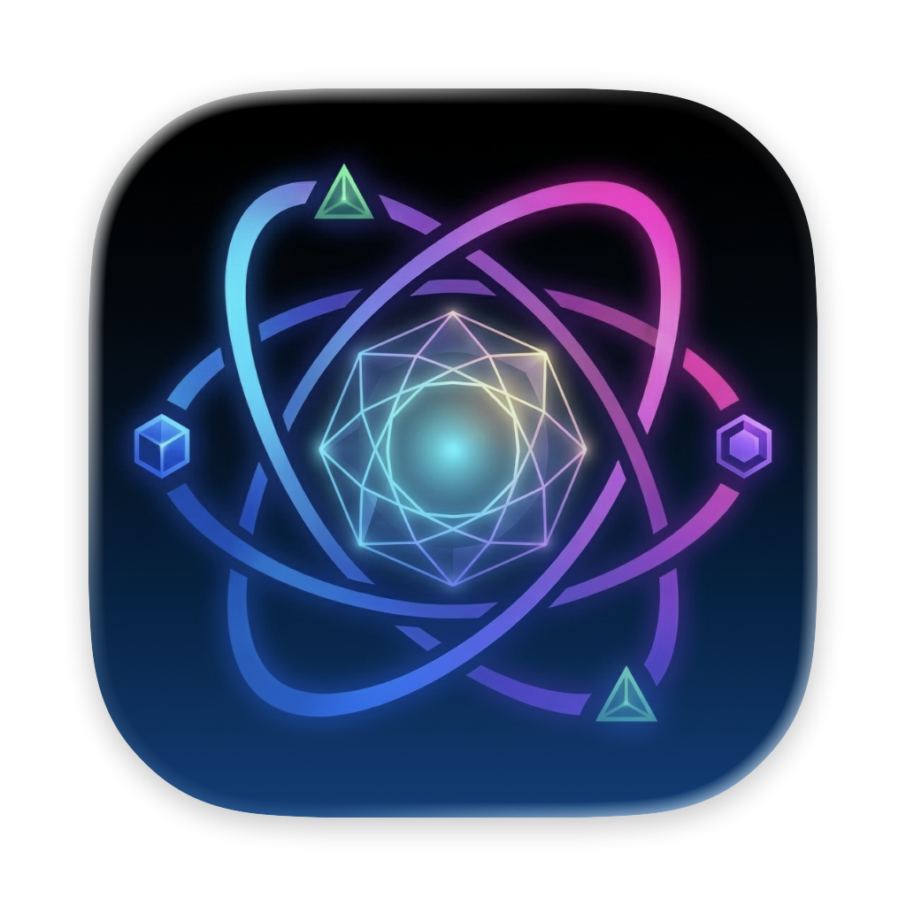

# Orbital

<p align="center">
  
</p>

Per-shell 環境管理工具，為 AI CLI 工具（Claude Code、Codex CLI、Gemini CLI）隔離帳號，輕鬆切換工作與個人情境，**同時保留跨帳號的對話連續性**。

## 問題

Claude Code、Codex、Gemini 等 AI CLI 工具，會將設定（API 金鑰、認證 token、偏好設定）存放在單一全域目錄。如果你同時有工作帳號與個人帳號，切換時就得手動搬移憑證，或者乾脆準備兩台電腦。

更麻煩的是，切換帳號通常意味著**對話歷史全部消失**。你正在用 Claude 處理任務，切到另一個帳號，session 就斷了 — 只能重頭開始、重新解釋所有上下文。

## Orbital 如何解決

Orbital 管理存放在 `~/.orbital/envs/` 下的命名環境。每個環境有自己獨立的認證憑證，但**預設共享 session 資料** — 讓你切換帳號後能直接接續對話。

- **認證隔離**：每個環境的每個工具都有獨立的設定目錄，憑證不會互相干擾
- **Session 共享**：對話歷史、專案上下文、session 資料透過 symlink 指向共享位置（`~/.orbital/shared/`），切換環境後 `claude --resume` 無縫接續
- **Per-shell 生效**：`orbital use work` 只影響當前終端機 — 其他視窗維持各自的環境

## 系統需求

- macOS 13+ 或 Linux
- bash 或 zsh

## 安裝

### 安裝腳本（推薦）

自動下載適合你平台的預建 binary，不需要安裝 Swift。

```bash
/bin/bash -c "$(curl -fsSL https://raw.githubusercontent.com/OffskyLab/Orbital/main/install.sh)"
```

支援 macOS（arm64、x86_64）與 Linux（x86_64、arm64）。若無預建 binary 則自動從原始碼編譯。

### Homebrew（macOS / Linux）

```bash
brew install OffskyLab/orbital/orbital
```

### APT（Ubuntu / Debian）

```bash
echo "deb [trusted=yes] https://offskylab.github.io/apt stable main" | sudo tee /etc/apt/sources.list.d/orbital.list
sudo apt update && sudo apt install orbital
```

### 從原始碼編譯

需要 Swift 6.0+。

```bash
git clone https://github.com/OffskyLab/Orbital.git
cd Orbital
swift build -c release
cp .build/release/orbital /usr/local/bin/orbital
```

### Shell 整合

安裝後執行一次：

```bash
orbital setup
source ~/.orbital/activate.sh
```

`orbital setup` 會產生 `~/.orbital/activate.sh` 並寫入 rc 檔（`~/.zshrc` 或 `~/.bashrc`，自動偵測）。新開的 shell 會自動載入。

## 快速開始

```bash
# 建立環境（預設共享 session）
orbital create work --description "工作帳號"
orbital create personal --description "個人帳號"

# 加入 / 移除工具（每次 wizard 處理一個工具）
orbital tools add -e work
orbital tools remove -e work

# 儲存憑證
orbital set env ANTHROPIC_API_KEY sk-ant-work123 -e work
orbital set env ANTHROPIC_API_KEY sk-ant-personal456 -e personal

# 切換環境 — 對話歷史會自動保留
orbital use work
claude                    # 開始對話
orbital use personal
claude --resume           # 無縫接續同一個 session

# 停用（清除所有 Orbital 環境變數）
orbital deactivate
```

## 指令

### 環境管理

| 指令 | 說明 |
|---|---|
| `orbital create <name>` | 建立新環境（預設共享 session） |
| `orbital create <name> --clone <source>` | 從現有環境複製工具與環境變數 |
| `orbital create <name> --isolate-sessions` | 建立環境並完全隔離 session |
| `orbital delete <name>` | 刪除環境（會要求確認） |
| `orbital delete <name> --force` | 不確認直接刪除 |
| `orbital rename <old> <new>` | 重新命名環境 |
| `orbital list` | 列出所有環境（`*` 標示目前啟用的） |
| `orbital info [name]` | 顯示環境的詳細資訊（預設為目前啟用的環境） |

### 切換

> 需要 shell 整合（`orbital setup`）

| 指令 | 說明 |
|---|---|
| `orbital use <name>` | 在當前 shell 啟用環境 |
| `orbital deactivate` | 停用目前的環境 |
| `orbital current` | 顯示目前啟用的環境名稱 |

### 設定

| 指令 | 說明 |
|---|---|
| `orbital tools add [-e <name>]` | 透過 wizard 加入工具（含登入狀態與設定複製） |
| `orbital tools remove [-e <name>]` | 從環境移除工具 |
| `orbital set env <KEY> <VALUE> -e <name>` | 設定環境變數 |
| `orbital unset env <KEY> -e <name>` | 移除環境變數 |
| `orbital which <tool>` | 顯示目前環境中工具的設定目錄路徑 |

> 如果已啟用環境（`orbital use <name>`），可省略 `-e` 參數。

### Session 管理

| 指令 | 說明 |
|---|---|
| `orbital sessions` | 列出當前專案的所有 AI tool session |
| `orbital sessions --claude` | 只顯示 Anthropic Claude session |
| `orbital sessions --codex` | 只顯示 OpenAI Codex session |
| `orbital sessions --gemini` | 只顯示 Google Gemini session |

### 跨工具

| 指令 | 說明 |
|---|---|
| `orbital run -e <name> <command>` | 在指定環境中執行指令 |
| `orbital delegate -e <name> "prompt"` | 委派任務給其他環境的 AI 工具 |
| `orbital resume <index>` | 用 index 接續 session（搭配 `orbital sessions`） |

### AI 工具整合（MCP）

Orbital 透過 [MCP](https://modelcontextprotocol.io/) 整合 Claude Code、Codex CLI 和 Gemini CLI。

```bash
orbital mcp setup
```

一行指令註冊 MCP server 並安裝 `/delegate` 和 `/sessions` slash commands。可用的 MCP 工具：

| 工具 | 說明 |
|---|---|
| `orbital_delegate` | 委派任務給其他帳號的 AI 工具 |
| `orbital_list` | 列出所有環境 |
| `orbital_sessions` | 列出當前專案的 session |
| `orbital_current` | 查看目前啟用的環境 |
| `orbital_memory_read` | 讀取共享專案記憶 |
| `orbital_memory_write` | 寫入共享專案記憶 |

**共享記憶**：所有 AI 工具讀寫同一份 `ORBITAL_MEMORY.md`。Claude 儲存的知識，Codex 和 Gemini 也能存取，反之亦然。

### Shell 整合

| 指令 | 說明 |
|---|---|
| `orbital setup` | 安裝 shell 整合到 rc 檔（冪等操作） |
| `orbital init` | 輸出 shell 整合腳本（供手動設定） |

## Session 共享

預設情況下，不同環境會共享 session 資料（對話歷史），讓你可以在切換帳號後接續同一個對話。共享的目錄會存放在 `~/.orbital/shared/<tool>/`，透過 symlink 連結到各環境。

如果需要完全隔離 session，可在建立環境時加上 `--isolate-sessions` 參數。

## 儲存結構

環境存放在 `$ORBITAL_HOME`（預設：`~/.orbital`）底下：

```
~/.orbital/
  current                # 上次啟用的環境名稱
  shared/                # 跨環境共享的 session 資料
    claude/
      projects/          # 各專案的對話歷史
      sessions/          # session 中繼資料
      session-env/       # session 環境快照
  envs/
    <UUID>/
      env.json           # 中繼資料：工具、環境變數、時間戳
      claude/            # CLAUDE_CONFIG_DIR 指向此處
        .claude.json     # 認證憑證（各環境獨立）
        projects/  -> ~/.orbital/shared/claude/projects   (symlink)
        sessions/  -> ~/.orbital/shared/claude/sessions   (symlink)
      codex/             # CODEX_CONFIG_DIR 指向此處
    <UUID>/
      env.json
      claude/
```

設定 `ORBITAL_HOME` 環境變數可使用自訂路徑。

## `orbital use` 設定的環境變數

| 工具 | 變數 |
|---|---|
| `claude` | `CLAUDE_CONFIG_DIR` |
| `codex` | `CODEX_CONFIG_DIR` |
| `gemini` | `GEMINI_CONFIG_DIR` |

透過 `orbital set env` 設定的自訂環境變數也會在 `orbital use` 時匯出。

## 多語系支援

Orbital 會偵測系統語系（`LC_ALL`、`LC_MESSAGES`、`LANG`），自動切換繁體中文或英文介面。

## 授權

Apache 2.0
