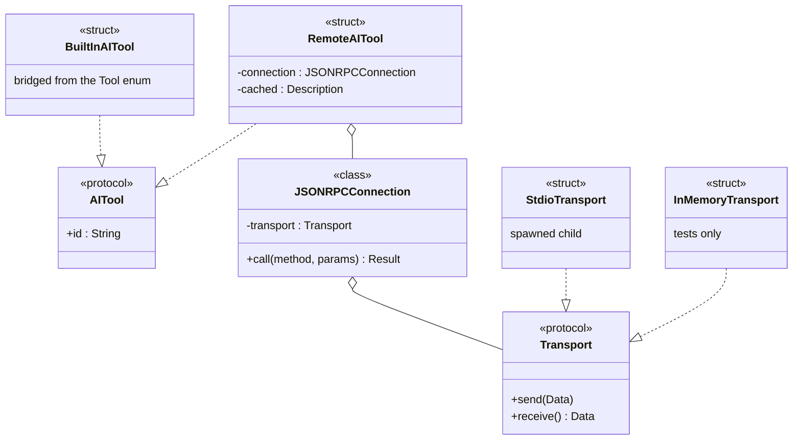
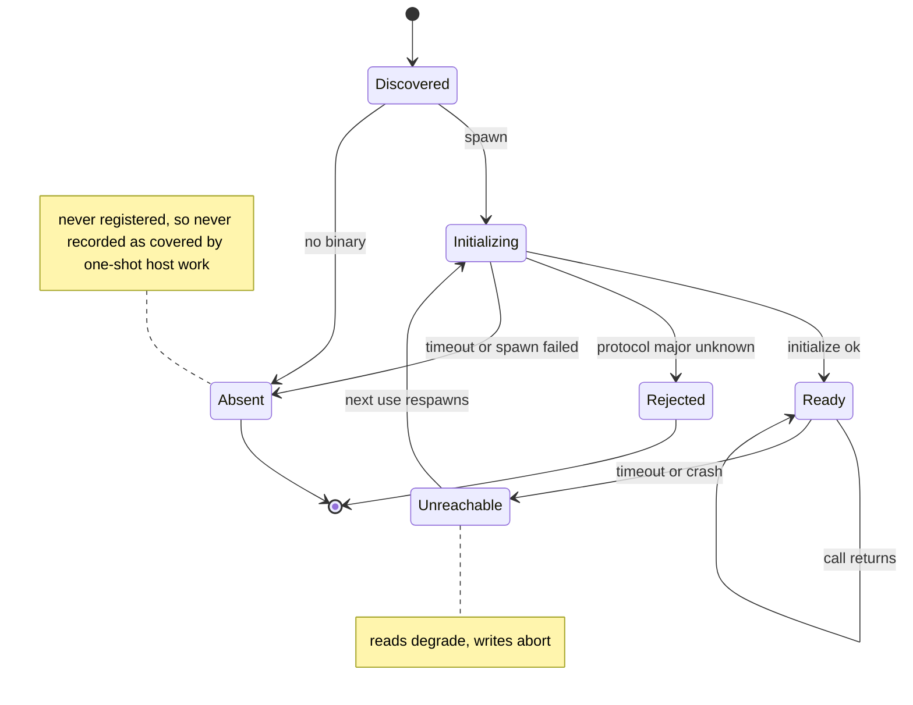

# The plugin boundary becomes a process boundary

**Date:** 2026-08-21
**Status:** design, awaiting review
**Predecessor:** [AIToolKit plugin framework](2026-08-21-aitoolkit-plugin-framework-design.md) — shipped as `OffskyLab/Orrery-AIToolKit` `0.0.1-dev.3`, integrated by PR #53

## Goal

Move one tool — claude — from being compiled into orrery to being described by
a separate process that orrery talks to over JSON-RPC, so that a third party
can add a tool without forking orrery.

This spec covers the **first three steps** of that work: the protocol, the
measurement that decides whether the transport is viable, the forwarding
proxy, and claude's *facts* travelling over the wire. Migrating claude's
*behaviour* is deliberately left to a later spec, written once real numbers
and a working pipe exist.

## Why this shape

### The problem with what shipped

`OffskyLab/Orrery-AIToolKit` `0.0.1-dev.3` defines an open `AITool` protocol
and a registry, and orrery registers its three built-in tools into it. But
nothing reads the registry: 33 call sites still iterate `Tool.allCases`, and
`Account.tool` is still the closed enum. A third-party tool registered today
gets nothing — no account directory, no command handling, no migration
coverage. Its only observable effect is appearing in `AIToolRegistry.shared.all`,
which no production code calls.

More fundamentally, the boundary is a *link-time* boundary. A third party
would have to fork orrery and add a target. That is not a plugin system.

### The decomposition

Full parity for a third-party tool is too large for one spec. Two axes were
considered: by layer (facts for all tools, then identity, then behaviour) and
by tool (one tool taken all the way).

**By tool wins**, because it is the only one that tests the interface. Doing
the facts layer across three tools proves that eight static fields can hold
three tools' static data, which was never in doubt. Taking claude — the most
complex tool, with credential parsing, session discovery, sandbox diagnostics
and takeover seeding — all the way is what surfaces what the protocol actually
needs.

codex and gemini stay on the existing `BuiltInAITool` bridge, sourcing their
facts from the enum. The registry does not care where a description came from.

## Architecture

### The boundary is a process

`orrery-claude` is a separate executable, discovered the way `orrery-sync`
already is: `ORRERY_CLAUDE_PATH`, then `~/.orrery/tools/`, then `PATH`. It
ships with orrery but is loaded through exactly the mechanism a third party
would use.

### The proxy is itself an `AITool`



The registry stays `[String: any AITool]`. A call site cannot tell a local
description from a remote one, and does not need to.

Two consequences are load-bearing:

- **Built-in and third-party take the same path.** Shipping claude this way is
  what proves the third-party path works.
- **Transport is a per-tool, reversible decision.** If a round trip proves too
  expensive for some tool, that tool can be linked in-process instead without
  touching a single call site.

### The wire is JSON-RPC 2.0

Line-delimited JSON-RPC over stdio, the same shape orrery's own MCP server
already speaks — `initialize` for version and capability negotiation, standard
error codes. This is not code reuse; MCP is a different protocol. It is reuse
of a shape already proven in this codebase.

The alternative considered was argv subcommands (`orrery-claude describe`,
`orrery-claude account-info --config-dir X`). It was rejected because it bakes
the process model into the protocol: no request ids means no concurrent
requests, so moving to a persistent transport later would require redesigning
the protocol rather than swapping the plumbing underneath it.

**Methods for this spec:**

```
initialize     → { protocolVersion, capabilities: { … } }
tool/describe  → { id, displayName, configDirectoryName, configDirEnvVar,
                   authLoginCommand, installCommand, sessionSubdirectories,
                   ansiColor }
```

Later specs add the behaviour methods. `initialize`'s `capabilities` is what
lets a plugin implement a subset without the host paying a round trip to
discover absence; `-32601 Method not found` is the fallback for one that slips
through.

### Serialization lives in a DTO, not the protocol

`AITool` refines `Sendable` alone. The wire type is a separate concrete
`Codable` struct. This is why removing `Codable` from the protocol was right:
a protocol cannot be `Decodable`, and a forwarding proxy could not conform to
one that tried.

## Failure handling

A plugin runs as the user, with the user's privileges. Nothing below limits a
*malicious* plugin — installing one is the trust decision. These rules limit
accidents, and stop one broken plugin from costing the host its working ones.

### stdout belongs to the protocol

Diagnostics go to stderr. A host reading a line it cannot parse **skips it**
rather than failing — the same tolerance orrery's MCP server already applies.

### Lifecycle



`Absent` and `Rejected` are terminal for the run and leave every other tool
untouched. An unknown protocol major version is **refused with an explanation**,
never guessed at or run degraded.

### Reads degrade, writes abort

A missing answer may be rendered as missing. An action that may not have
happened is never reported as done.

Listing accounts is worth doing with one field blank. Recording a credential
as copied when it may not have been is the failure that looks like success.

For this spec only `tool/describe` exists, and it is a read: a plugin that
fails to describe itself simply does not register.

### Interaction with one-shot migrations

orrery's one-shot migrations record *which tools* they covered (`MigrationFlag`,
shipped in PR #53). A tool whose plugin failed to load must not be recorded as
covered, or it would be skipped forever once the plugin is fixed.

This already holds: `pending` is computed from the registry, so an absent tool
is never in the set and never recorded, and `markCovered` unions rather than
replaces, so a later run picks it up. **This must be covered by a test, not
left as an emergent property.**

### An installation-time distinction

`orrery-claude` ships with orrery, so its absence means a broken install and is
a **hard error** for claude. A third-party plugin's absence is a **soft error**:
that tool disappears, everything else continues. This is a packaging
distinction, not an interface one — both take the identical protocol path.

## Steps

Each step ends with claude fully working and something independently
verifiable.

### Step 1 — Protocol scaffolding, and measurement

Build the JSON-RPC layer in AIToolKit: `Transport` protocol, `StdioTransport`,
`InMemoryTransport`, `JSONRPCConnection`, and a `serve()` entry point a plugin
author calls. Add a minimal plugin answering only `initialize` and
`tool/describe`.

Then **measure**, and measure honestly:

- one spawn + `initialize` + `tool/describe` round trip
- **instrument orrery to find its actual high-frequency call sites**, rather
  than reasoning about which sound frequent

That second item exists because reasoning already produced a wrong answer once
during design: the Claude Code status line was assumed to be the hot RPC
client, and it turned out never to invoke orrery at all — it reads the config
tree and queries the keychain directly.

**Exit criterion:** a number, and a named list of real hot call sites. If the
numbers are bad, we learn it before writing any of claude's logic.

### Step 2 — `RemoteAITool` and discovery

The proxy, binary discovery, `initialize` handshake, version refusal, and
registration of a remote tool. Not observable in production yet — nothing
reads the registry — so its verification is entirely in tests.

**Exit criterion:** a plugin binary present on disk appears in
`AIToolRegistry.all`; an absent, hanging, crashing, or wrong-version one does
not, and does not disturb the other tools.

### Step 3 — claude's facts come over the wire

`orrery-claude` answers `tool/describe` with claude's real eight fields. The
call sites that need facts read them from the registry. codex and gemini stay
bridged from the enum.

**Exit criterion:** the full suite passes with claude's facts sourced from a
separate process, and a parity test pins the plugin's description against the
enum's so the two cannot diverge unnoticed.

`Tool`'s fact properties **stay** until their call sites migrate, which is the
next plan. An earlier draft of this spec said they would be gone; that was
over-reach, found while writing the implementation plan. The call sites split
by safety and only one half is mechanical:

- **32 safe** — `defaultConfigDir` and `subdirectory`. `configDirectoryName`
  joined to `userHomeURL()` reproduces the first exactly; `id` is the second.
- **11 unsafe** — `envVarName`. `Tool.gemini.envVarName` returns
  `"GEMINI_CONFIG_DIR"` while `configDirEnvVar` is `nil`, and PR #52 needs that
  literal string as a key to *remove* from a child environment. Migrating these
  silently changes gemini's behaviour and collides with an unmerged PR.

Removing a property whose 11 remaining callers cannot be migrated is not a
smaller step, it is a broken one.

## Testing

### Most tests must not spawn

Process-spawning tests are slow and flaky in CI. `InMemoryTransport` carries
the bulk of the suite; a small number of tests use a real child process to
prove the real pipe works. The transport abstraction introduced for
stdio-versus-socket pays for itself twice.

### Timeouts must be injectable

The client takes a timeout parameter. Tests use milliseconds. This is a
constraint on the interface, decided now — a hardcoded ten-second timeout
produces a suite nobody will run.

### The fake plugin is also a conformance suite

A test executable whose behaviour is selectable:

| behaviour | what it proves |
|---|---|
| `ok` | the happy path |
| `hang` | call timeouts fire |
| `crash-after-initialize` | mid-session death is handled |
| `garbage` | non-JSON on stdout does not kill the host |
| `noisy` | a stray `print()` is skipped, not fatal |
| `partial` | a truncated reply is handled |
| `wrong-version` | an unknown major is refused with an explanation |

This doubles as a conformance suite a plugin author can run against their own
binary — a real deliverable for a plugin framework, not a by-product.

### The important assertions are negative

```
given  a plugin that fails to load
then   the other tools still register
and    the failed tool is NOT recorded as covered by one-shot work
and    a later run with the plugin fixed DOES cover it
```

Asserting only that an error was thrown misses the case where an error was
thrown *after* state was half-changed.

## Out of scope

- **Behaviour migration.** `accountInfo`, session discovery, credential
  copying, login-state moves. Next spec, once measurement and a working pipe
  exist.
- **The directory-decomposition capability** — a tool declaring which of its
  paths and keys are identity-bound versus shared. Recorded in AIToolKit's
  README as direction; it is the largest and most valuable capability, and it
  belongs after the failure machinery is proven because it moves users' real
  data.
- **`Account.tool` opening up.** Still the closed enum; a third-party tool
  cannot have an account. Sub-project B.
- **`Workspace.isolatedSessionTools: Set<Tool>`** — a second place the enum
  leaks into a persisted format, found during design. Belongs with sub-project
  B.
- **A persistent or socket transport.** The protocol permits it; nothing
  builds it until measurement demands it.

## Open questions, deliberately deferred

**How to model an environment variable a tool ignores but that must be cleared
from an inherited environment.** gemini declares `configDirEnvVar == nil`
because gemini-cli reads only `$HOME/.gemini`, but PR #52 still needs the
literal name `GEMINI_CONFIG_DIR` as a key to *remove* from a child
environment. `AITool` currently cannot express both facts.

Deferred because designing a field for gemini before anyone implements gemini
is guesswork. It becomes real when gemini gets a plugin.

**Whether `AIToolRegistry.register` should refuse a duplicate id rather than
replacing.** Today it replaces, so a third party could register `"claude"` and
displace the built-in. Refusing is probably right, with built-ins registering
first. It is a behaviour change to a published package and is cheapest to make
early — but it is not required by this spec's steps.
